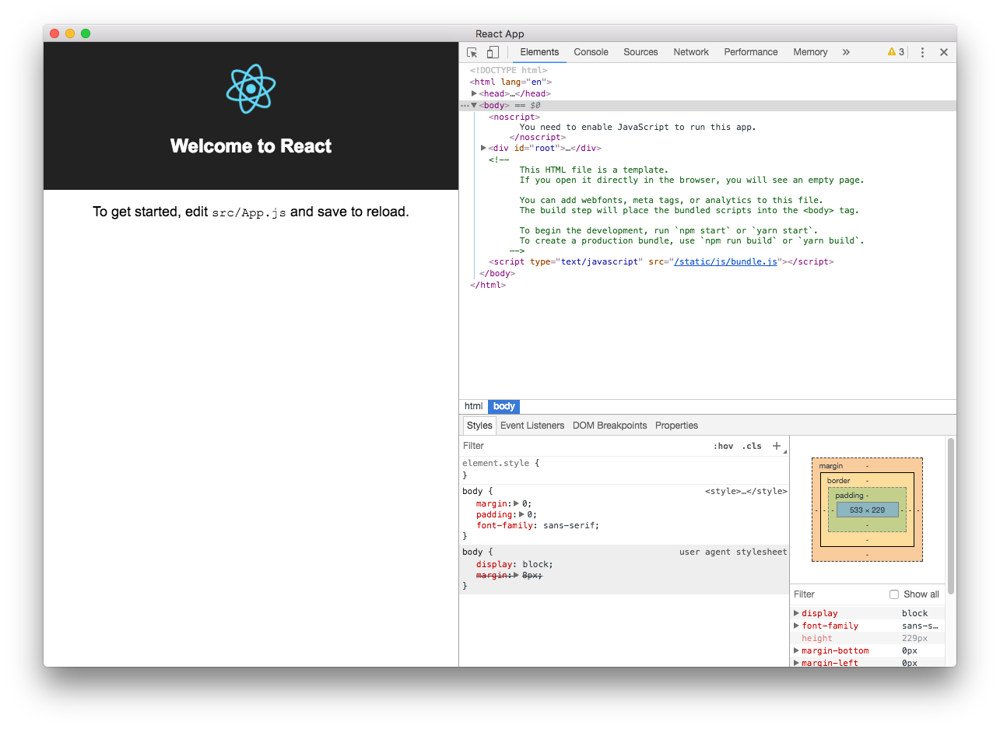

## create-react-app-electron ⚡️

[react-app-rewire-less](https://github.com/timarney/react-app-rewired/tree/master/packages/react-app-rewire-less) | [react-hot-loader](https://github.com/gaearon/react-hot-loader) | [react-app-rewire-hot-loader](https://github.com/cdharris/react-app-rewire-hot-loader)

Incorporates React in Electron.


```
yarn run electron-dev
```



Inspired by blog post:
[https://medium.com/@kitze/%EF%B8%8F-from-react-to-an-electron-app-ready-for-production-a0468ecb1da3](https://medium.com/@kitze/%EF%B8%8F-from-react-to-an-electron-app-ready-for-production-a0468ecb1da3)